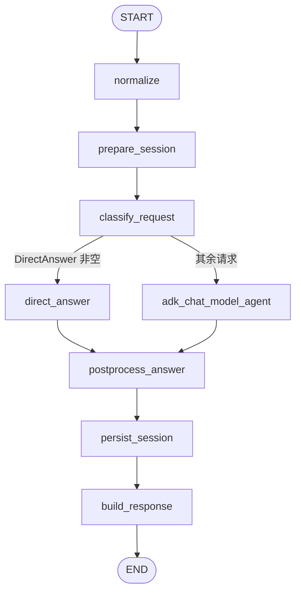
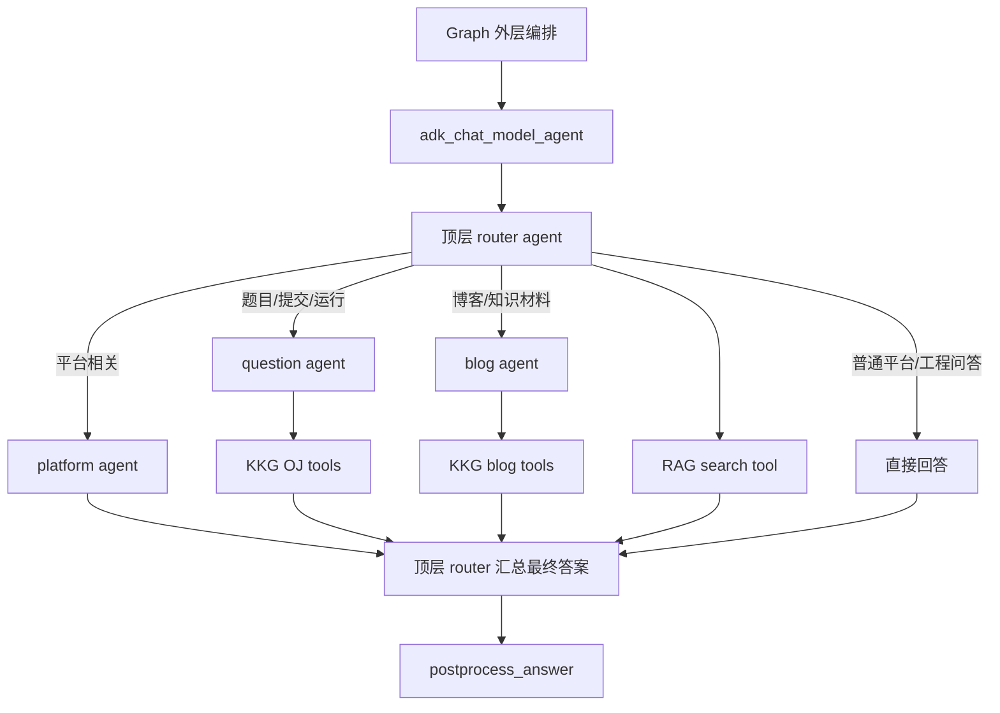
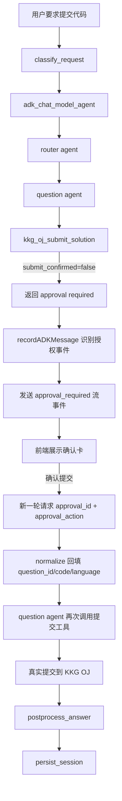
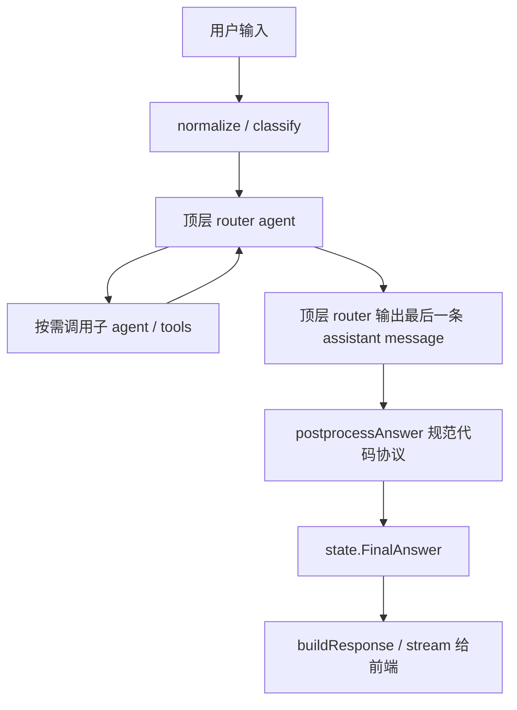

# KKG Agent Eino

KKG Agent Eino 是面向 KKG 项目的智能体工作台。前端使用 Nuxt + Vue，后端使用 Go + CloudWeGo Eino，把 chain、graph、RAG 向量库和 KKG 现有 API 工具化放在同一个工程边界内，但开发环境与 KKG 主项目分离。

## 当前骨架

- `apps/api`: Go Agent API，已接入 Eino `chain` 与 `graph` 两种编排入口。
- `apps/web`: Nuxt 前端，提供 chain/graph 模式切换、prompt 输入和运行结果查看。
- `infra/postgres`: pgvector 初始化脚本，作为 RAG 向量库的本地工业化基线。
- `.devcontainer`: 独立开发容器，包含 Go、Node、Postgres/pgvector、Redis、MinIO。
- `docs`: KKG 鉴权/API、架构和 RAG 流程说明。

## 本地启动

```bash
cp .env.example .env
docker compose -f docker-compose.dev.yml up -d postgres redis minio

cd apps/api
go mod download
go run ./cmd/agent-api

cd ../web
npm install
npm run dev
```

访问：

- Nuxt Web: `http://localhost:3000`
- Agent API: `http://localhost:8088/health`
- MinIO Console: `http://localhost:9001`

## API 快速验证

```bash
curl -sS http://localhost:8088/health
curl -sS -X POST http://localhost:8088/api/v1/agent/run \
  -H 'Content-Type: application/json' \
  -d '{"mode":"graph","query":"为 KKG OJ 题目生成题解思路"}'
```

## Agent 执行流程

当前主执行入口是 `graph`。外层负责固定流程编排，内层 `adk_chat_model_agent` 负责 ReAct 式推理、调用子 agent 和工具。

### 1. Graph 主流程



各节点职责：

- `normalize`: 规范化输入，提取 `question_id` / `submission_id`，处理授权确认回流。
- `prepare_session`: 创建或恢复会话，读取历史消息并清理不完整的工具调用尾巴。
- `classify_request`: 生成 `intent_hints`、`tool_policy`、`submit_confirmed` 等运行时上下文。
- `direct_answer`: 处理精确复述、取消提交这类不需要模型的请求。
- `adk_chat_model_agent`: 顶层路由 agent，负责 ReAct 推理、委派子 agent、调用工具。
- `postprocess_answer`: 统一代码渲染协议，修正最终回答格式。
- `persist_session`: 持久化本轮对话；若停在提交授权，会只保存安全消息。
- `build_response`: 汇总 answer、trace、tool results、token usage，并向前端发出最终事件。

### 2. 顶层 ReAct 与子 Agent / Tool 关系



这里的关键点是：

- 顶层 `router agent` 是真正和用户“收口对话”的模型。
- 子 agent 和底层工具不会直接把最终答案原样返回给前端。
- 它们的结果会先回到顶层 `router agent`，再由顶层组织成最终回复。

### 3. 提交代码授权流程

只有正式提交代码才需要用户确认。题面查询、题解、运行、提交结果查询都不走这个分支。



### 4. 最终答案生成路径



最终答案通常来自顶层 `router agent` 的最后一条 assistant message；随后会经过一次后处理，把代码回答统一成 `<kkg-code ...>` 协议，再通过流式事件和最终 `done` 响应返回前端。

## 与 KKG 项目的边界

本仓库不嵌入 KKG 后端源码。开发时通过 `.env` 中的 `KKG_BLOG_BASE_URL`、`KKG_OJ_BASE_URL` 指向独立运行的 KKG 服务；智能体后端把这些 API 包装成工具，沿用 KKG 的 `access_token` cookie 或 Bearer token。

更多细节见：

- [架构说明](docs/architecture.md)
- [Eino 业务流程约束](docs/eino-workflow.md)
- [KKG 鉴权与 API 契约](docs/kkg-api-auth.md)
- [RAG 向量库流程](docs/rag-pipeline.md)
